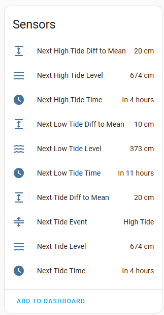
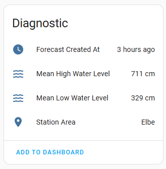
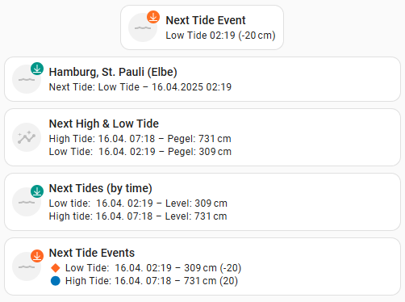

[![GitHub Release][releases-shield]][releases]
[![License][license-shield]](LICENSE)
[![hacs][hacsbadge]](hacs)

# BSH Tides for Germany Integration for Home Assistant

Custom integration to fetch tidal forecast data from the German Federal Maritime and Hydrographic Agency / the Bundesamt für Seeschifffahrt und Hydrographie (BSH).

DISCLAIMER: This project is a private open source project and doesn't have any connection with BSH. The integration utilizes a public but uncommented API of the BSH. It might break or vanish in the future.

🌊 **Features**

Creates Home Assistant devices and sensors for multiple data points:
- time, water level, expected deviation from mean water level for the next upcoming tide
- time, water level, expected deviation from mean water level for the upcoming high and low tides
- mean low/high tide water levels for the selected station
- timestamp of when the forecast was made
- geograpical area of the station
- You can add multiple stations to HA.

📡 **Data Source**

The [BSH Tide Data](https://wasserstand-nordsee.bsh.de/) provides tide data for the German North Sea costal region including measuring points for tide affected rivers: 
- Ems, 
- Weser,
- Elbe,
- Jade und Ostfriesland,
- Nordfriesland bis Elbmündung (inkl. Helgoland)

Check [link](https://wasserstand-nordsee.bsh.de/) for supported gauging stations.

Data © Bundesamt für Seeschifffahrt und Hydrographie (BSH)

## 🔧 Installation

1. Copy `custom_components/bsh_tides` into your Home Assistant `config/custom_components/` directory.
2. Restart Home Assistant.
3. Go to `Settings → Devices & Services → + Add Integration` and select **"BSH Tides for Germany"**.
4. Select the area and subsequently the actual gauging station in the UI.

## 📍 Supported Stations

The full list of supported stations can be seen in the map overview at https://wasserstand-nordsee.bsh.de/

## Visualization & Template Examples

Find the code for the above cards as examples in these files:

- [Dashboard badge](docs/dashboard_examples/bsh_tides_badge.yaml)
- [Next tide at station](docs/dashboard_examples/bsh_tides_next_tide_at_station.yaml) (Mushroom Template)
- [Next high and low tide](docs/dashboard_examples/bsh_tides_next_high_and_low_tide.yaml) (Mushroom Template)
- [Next high and low tide sorted by time](docs/dashboard_examples/bsh_tides_next_tides_by_time.yaml) (Mushroom Template)
- [Next tide events](docs/dashboard_examples/bsh_tides_next_tide_events.yaml) (Mushroom Template)

You can copy these into your dashboard using the YAML editor.

## 📄 License & Attribution

- Data: © BSH – Bundesamt für Seeschifffahrt und Hydrographie  
- Integration: MIT License

[hacs]: https://github.com/custom-components/hacs
[hacsbadge]: https://img.shields.io/badge/HACS-Custom-orange.svg?style=for-the-badge
[license-shield]: https://img.shields.io/github/license/custom-components/blueprint.svg?style=for-the-badge
[releases-shield]: https://img.shields.io/github/release/EnlightningMan/ha-bsh_tides.svg?style=for-the-badge
[releases]: https://github.com/EnlightningMan/ha-bsh_tides/releases
[downloads-shield]: https://img.shields.io/github/downloads/EnlightningMan/ha-bsh_tides/latest/total.svg?style=for-the-badge
[downloads-all-shield]: https://img.shields.io/github/downloads/EnlightningMan/ha-bsh_tides/total.svg?style=for-the-badge